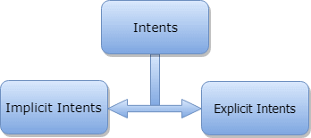
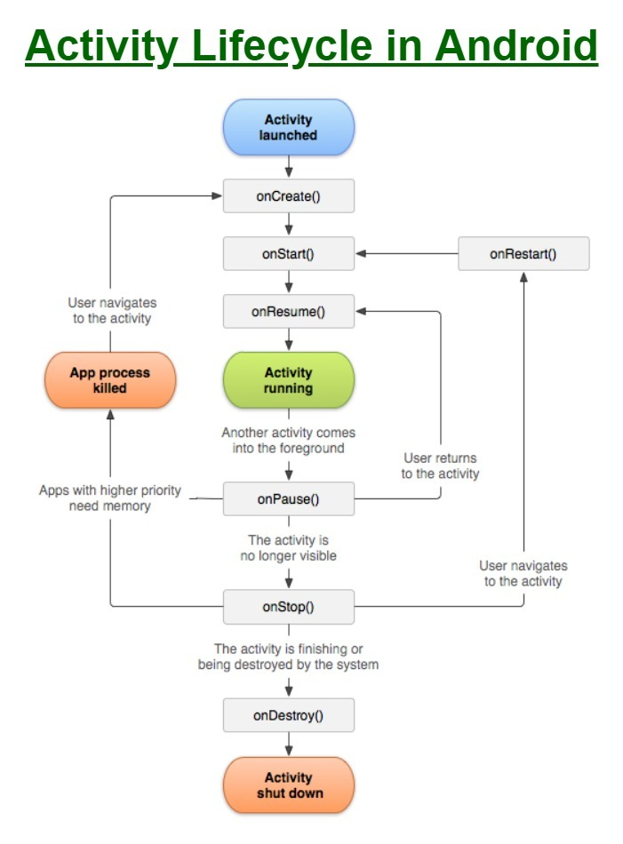

## This Android Exercise file is created on 12pm 30-Nov-2020 by Zayar Myo Thwin.

### Context

Context ဆိုတာက ကြားခံ application environment နဲ့ global information ကိုချိတ်ဆက်ပေးတဲ့ကြားခံ
Context လုပ်လို့ရတဲ့ method တွေက

1. getApplicationContext()
2. getContext()
3. getBaseContext()
4. or this(when in the activity class)

- Examples for uses of context:

  1. Creating new objects:Creating new views,adapters,listeners

```java
   TextView tv=new TextView(getContext());
   ListAdapter adapter=new SimpleCursorAdapter(getApplicationContext());
```

- Activity ထဲမှာ view တွေကို dynamically create လုပ်တဲ့အခါမှ context ကိုလိုအပ်တယ်။
  ဉပမာ-code ကနေပီးတော့ TextView ကိုဖန်တီးမယ်ဆိုရင် TextView ရဲ့ constructor က context object ကိုယူလိုက်တယ် ဘာလို့လဲဆိုရင် Activity class က Context ရဲ့ subclass ဖစ်‌ေနလို့။
- Context Object က application ရဲ့ resources တွေနဲ့ တခြား features တွေကိုရအောင်ထောက်ပံပေးတယ်။
- Activity တိုင်းက Context ဖစ်ပီးတော့ View တိုင်းက Context ကိုလိုအပ်တယ်။

### Difference between Activity Context and Appliaction Context


- Need of Context:
  - View တိုင်းဟာ မှန်ကန်တဲ့ resources(eg.the theme,strings etc) ‌ေတွရရှိဖို့အတွက် context ကိုလိုအပ်တယ်။

### Intents and Filters

Android Intent ဆိုတာလုပ်‌ေဆာင်ရမယ့် operation အတွက်အကျဉ်းချုပ်‌ေဖာ်ပြချက်ဘဲဖစ်တယ်။ဘလိုမျိုးသံုးလို့ရလဲဆိုရင် Activity တစ်ခုကိုစဖို့အတွက် startActivity မှာသုံးလို့ရမယ်။ broadcastIntent , startService(Intent) or bindService(Intent, ServiceConnection, int) စတဲ့ backgroud service ‌ေတွနဲ့ချိတ်ဆက်တဲ့အခါမှာလဲသုံးလို့ရတယ်။

- ဉပမာ-Activity တခုရှိတယ် အဲ့ Activity က email client တခုကို email ပို့တဲ့ဟာဆိုပါဆို့ Activity က ACTION_SEND ဆိုတာကို Android Intent resolver ထဲကိုပို့လိုက်မယ်။

```java
Intent email=new Intent(Intent.ACTION_SEND,Uri.parse("mailto:"));
email.putExtra(Intent.EXTRA_EMAIL,recipients);
email.putExtra(Intent.EXTRA_SUBJECT,subject.getText().toString());
email.putExtra(Intent.EXTRA_TEXT,body.getText().toString());
startActivity(Intent);
```

### Action

Action ဆိုတာက Intent object ရဲ့ မဖစ်မ‌ေနလုပ်ရ‌ေသာအစိတ်အပိုင်း။ ACTION_VIEW,ACTION_DIAL စတာ‌ေတွ။

### Data

Intent filter ထဲကို data specification ‌ေတွထည့်တာ

## Types of Intents

Explicit Intent နဲ့ Implicit Intent ဆိုပီးနှစ်မျိုးရှိပါတယ်။


### Explicit Intents

First Activity က‌ေန Second Activity ကိုသွားတာကို Explicit Intentလို့‌ေခါ်တယ်

```java
//Explicit Intent by specifying its class name
Intent i=new Intent(FirstActivity.class,SecondActivity.class)
//starts Target Activity
startActivity(i);
```

### Implicit Intents

Implicit Intent ကကျ‌ေတာ့ အခြား applications ‌ေတွမှာ component ‌ေတွကို activate လုပ်တဲ့အခါမျိုးမှာသုံးတယ်။

```java
Intent read1=new Intent();
read1.setAction(android.content.Intent.ACTION_VIEW);
read1.setData(ContactsContract.Contact.CONTENT_URI);
startActivity(read1);
```

### Function of Intent နဲ့ Custom Browser ဖွင့်တဲ့ app ကို Example 1 မှာရေးထားတယ်

- Function of Intent ထဲမှာတော့ Intent ကိုအသုံးပြုပီး website တခုဖွင့်တာနဲ့ Phone call တခုခေါ်တာကိုပြပေးထားတယ်
- Custom Browser မှာတော့ ကိုယ်ပိုင် app မှာ Browser ဖွင့်တဲ့ပုံစံလုပ်ထားတယ် Browser name ရိုက်ထည့်ရတဲ့ text box မှာတော့ http://www.google.com ဘာညာဆိုပီး ပြည့်ပြည့်စုံစုံရိုက်ထည့်ပေးဖို့လိုအပ်တယ်။

### Intent Filters

Android OS filters များကိုအသုံးပြုပီးတော့ Activites,Servies,Broadcast receivers တွေနဲ့သက်ဆိုင်တဲ့ action,categories,data scheme တွေကိုရေးရတယ်။<intent-filter></intent-filter> element ကိုအသုံးပြုပီးတော့ activies,services,broadcaste receivers တွေနဲ့သက်ဆိုင်တဲ့ action,categories,data scheme တွေအဖစ် android manifest file ထဲမှာသွားပီးရေးထည့်ပေးရတယ်။ Intent-filter ထည့်ရေးထားတဲ့ဉပမာက

```xml
 <activity android:name=".MainActivity">
            <intent-filter>
                <action android:name="android.intent.action.VIEW"/>
                <category android:name="android.intent.category.DEFAULT"/>
                <data android:scheme="http://"/>
                <data android:scheme="https://"/>
            </intent-filter>
            <intent-filter>
                <action android:name="android.intent.action.MAIN" />
                <category android:name="android.intent.category.LAUNCHER" />

            </intent-filter>
  </activity>
```

### Activites

Android မှာ activity ဆိုတာ screen မှာမြင်ရတဲ့ screen တခုကိုဆိုလိုတယ်။activity တခုကို onCreate() ဆိုတဲ့ method နဲ့စတယ်။



Activity class ထဲမှာဆိုရင် onCreate(),onStart(),onResume(),etc.. စတဲ့ call back method တွေရှိတယ်။ဒါပေမဲ့ class တခုထဲမှာတော့ call back method တွေ အားလုံးထည့်ဖို့တော့မလိုအပ်ဘူး။ call back method တွေကိုသိထားဖို့တော့လိုအပ်တယ်။

- onCreate()-activity ပထမဦးဆုံး create လုပ်လိုက်တဲ့အခါမှာသုံးတယ်။
- onStart()-activity ကိုuser ကမြင်လိုက်ပီဆိုရင်ဒီ method ကအလုပ်လုပ်ပီ။
- onResume()-User က application ကိုစပီးသုံးလိုက်ပီဆိုရင်ဒီ method ကအလုပ်လုပ်တယ်။
- onPause()-activity နှစ်ခုရှိမယ်၊အဲ့ထဲမှာမှ ဒုတိယ activity ကနေ back နဲ့ထွက်ပီး ပထမ activity ကို User ကပြန်သုံးနေပီဆိုရင် ဒုတိယ activity မှာ onPause() method ကအလုပ်လုပ်နေမယ်။ onPause() method မှာ user input တွေ code implement တွေကအလုပ်လုပ်မှာမဟုတ်ဘူး။
- onStop()-activity ကိုလုံးဝမမြင်ရတော့ဘူးဆိုရင်သုံးတဲ့ method။
- onDestroy()-activity ကိုလုံးဝဖျက်လိုက်တယ်ဆိုရင်ဒီ methodဖစ်တယ်။ phone ရဲ့ task manager ကနေ appliaction ကိုမသုံးတော့ဘဲဖျက်လိုက်တယ်ဆိုရင် onDestroy() method ဘဲဖစ်တယ်။
- onRestart()-activity ကို stop လုပ်ထားပီးတာကိုမှ ပြန်ပီး restart လုပ်တာဆိုရင်ဒီ method ကအလုပ်လုပ်တယ်။

### Saved Instance State

တခါတလေမှာ application တခုဟာသုံးနေရင်းနဲ့ screen orientation ကြောင့် onCreate() အဆင့်ကိုပြန်ရောက်သွားတာမျိုးတွေရှိတက်တယ်။အဲ့လို onCreate() အဆင့်ကိုပြန်ရောက်သွားတယ်ဆိုရင် process တွေကအသစ်ကနေပြန်ရောက်သွားမယ်။အဲ့လို onCreate() အဆင့်ကိုပြန်ရောက်သွားတဲ့အခါမျိုးမှာ process တွေကိုအသစ်ကပြန်မရောက်ချင်ဘူးဆိုရင် onCreate() method ထဲမှာ bundle အနေနဲ့ပါတယ် onSaveInstanceState() method ကို override လုပ်ပြင်ပီးရေးထားရမယ်။

- SaveInstanceState example မှာဆိုရင် app ထဲမှာ နံပါတ်တခုရေးထားတယ် screen ကို tap တချက်နှိပ်လိုက်တာနဲ့နံပါတ်ကပြောင်းသွားမယ် screen orientation ကြောင့် onCreate() method ပြန်ရောက်တဲ့အခါ screen tap ကြောင့် နံပါတ်ပြောင်းတာကိုပါ အသစ် 0 ကနေ ပြန်မပြောင်းအောင် onSaveInstanceState() ကို override လုပ်ထားပီးရေထားတယ်။

### Services

Service ဆိုတာကတော့ application ကိုမဖွင့်ဘဲနဲ့ background မှာ run နေနိုင်အောင်လုပ်တဲ့ component။Application destoryed ဖစ်သွားရင်တော့ background မှာ run နေနိုင်သေးတယ်။ Services မှာ Stated နှင့် Bound ဆိုပီး state ၂ခုရှိတယ်။

- Started-application activity တခုက startService() ဆိုတဲ့ method နဲ့စဖွင့်လိုက်မယ်ဆိုရင် Service က start ဆိုတဲ့အဆင့်မှာရောက်နေမယ်။Service က start ဖစ်သွားမယ်ဆိုရင် application destoryed ဖစ်သွားရင်တော့ backgroud မှာ run နေနိုင်မယ်။
- Bound-bindService() ထဲမှာ application component ကို binds ထားလိုက်ဆိုရင် Service က Bound အဆင့်ကိုရောက်သွားမယ်။Bound Service က background မှာ run ပီး send request တွေ get result တွေနဲ့ တခြား process တွေကိုလုပ်ပေးနိုင်တယ်။

#### Android Service Lifecycle


- Services မှာ သက်ဆိုင်ရာ callback method တွေရှိတယ်။
- onStartCommand()
- onBind()
- onUnbind()
- onRebind()
- onCreate()
- onDestory()

### onStartCommand() method

onStartCommand က system ကို service instance ကိုဘလို create လုပ်ရမလဲဆိုတာကိုပြောဖို့ service maintenance state ကို return ပြန်ပေးတယ်။

- START_STICKY
- START_NOT_STICKY
- START_REDELIVER_INTENT
- toast_every_six_second example က ၆စက္ကန့်တိုင်းမှာ toast စာသားပေါ်အောင်ရေးထားတယ်။

### Bound Service

- Audio player example မှာ bond service အကြောင်းကိုရေးထားတယ်။

### Broadcast Receivers

Broadcast Recievers တခြား applications or system ကိုယ်တိုင်ကပို့တဲ့ broadcast message တွေကို respond ပြန်တဲ့နေရာမှာသုံးတယ်။အဲ့ဒီ့ message တွေကို events or intents တွေလို့လဲခေါ်တယ်။ BroadcastReceiver အလုပ်လုပ်ဖို့အတွက်အောက်က အချက်နှစ်ချက်လိုအပ်တယ်

- Creating the Broadcast Receiver
- Registering Broadcast Receiver

### Android - Content Providers

Content providers component က application တခုကနေပီး တခြားတခုက request လုပ်တဲ့အခါမှာ data တွေကိုထောက်ပံပေးတာ။ Requests တွေကို ContentResolver class ရဲ့ methods တွေကနေပီးတော့ handle လုပ်ပေးတယ်။ Content provider ကနည်းမျိုးစုံကိုသုံးပီးတော့ data တွေကို သိမ်းဆည်းပေးတယ်။ Data တွေကို database, files, network တွေထဲမှာပါသိမ်းဆည်းပေးတယ်။

### AsyncTask

Async Task ဆိုတာက android ကနေ provide လုပ်ပေးထားတဲ့ abstract class ဘဲဖစ်တယ်။ Async Task က heavytask တွေကို background မှာလုပ်ဆောင်ပေးပီးတော့ UI thread ကိုလဲပေါ့ပေါ့ပါးပါးဖစ်အောင်လုပ်ပေးတယ် အဲ့လိုတွေလုပ်ပေးနိုင်လို့ application ကလဲ ပိုပီး responsive ဖစ်တယ်။

- Android application က single thread ပေါ်မှာ runတယ်။ Single Thread ကြောင့် responseပြန်ဖို့အချိန်အကြာကြီးလိုအပ်တဲ့ task တွေဟာ application ကို non-responsive ဖစ်စေတယ်။ အဲ့လိုဖစ်တာကိုရှောင်ဖို့အတွက် AsyncTask ကိုသုံးရတယ်။
  Android AsyncTask class မှာသုံးတဲ့ basic methods တွေက
- doInBackground() - background မှာ execute လုပ်မဲ့ code တွေဟာဒီထဲမှာပါမယ်။
- onPreExecute() - background processing မစတင်မီမှာ execute လုပ်မဲ့ code တွေပါမယ်။
- onPostExecute() - doInBackground() method process လုပ်တဲ့ပီးသွားတဲ့အခါမှာ execute လုပ်မဲ့ code တွေကိုသုံးတာ။ doInBackground က result တွေကဒီ method ထဲမှာပါမယ်။
- onProgressUpdate() - doInBackground method က progress update တွေကို ဒီ method ကနေရမယ်။ UI thread ကို update လုပ်ဖို့အတွက်လဲဒီ method ကိုသုံးလို့ရတယ်။
- onCancled() - user ကနေ task ကို cancel လုပ်လိုက်ရင်ဒီ method ကအလုပ်လုပ်မယ်။
  Andrid AsyncTask မှာသုံးမဲ့ generic types ၃ခုက
- Params
- Progress
- Result

```java
public class ProcessTask extends AsyncTask<Integer,Integer,String> {
    @Override
    protected void onPreExecute() {
        //The first execution method
        super.onPreExecute();
    }

    @Override
    protected String doInBackground(Integer... integers) {
        //Background Process
        return "Completion of execution";
    }

    @Override
    protected void onProgressUpdate(Integer... values) {
        //Upgrade Progress to UI
        super.onProgressUpdate(values);
    }

    @Override
    protected void onPostExecute(String s) {
        //after execution
        super.onPostExecute(s);
    }
}

```

### Storage

Android မှာ application data တွေကို options တွေအမျိုးမျိုးနဲ့ထိန်းသိမ်းထားလို့ရတယ်။ ကိုယ်လိုအပ်တဲ့အပေါ်မှာမူတည်ပီးတော့ private အနေနဲ့သိမ်းမလား တခြား applications (user)တွေ access လုပ်လို့ရအောင်သိမ်းမလား၊ data တွေအတွက် space ဘလောက်လိုအပ်မလား ပေါ်တွေကိုမူတည်ပီးတော့ data တွေကို store လုပ်ထားလို့ရတယ်။ Data storage options တွေကတော့-

- Shared Preferences - Store primitive data in key-value pairs.
- Internal Storage - Store private data on the device memory.
- External Storage - Store public data on the shared external storage.
- SQLite Databases - Store structured data in a private database.
- Network Connection - Store data on the web with your own network server.

#### Shared Preferences

Shared Preferences class တွေက primitive data types ရဲ့ key-value pairs တွေကို save လုပ်ဖို့နဲ့ retrieve လုပ်ဖို့အတွက် general framework ကိုထောက်ပံပေးတယ်။ Primitive data တွေဖစ်တဲ့ booleans, floats, ints, longs, and string စတာတွေကို Sharedpreferences ကို အသုံးပြုပီးတော့ save မှတ်လို့ရတယ်။ Applications မှာ SharedPreferences object ကိုရဖို့အတွက်ဒီ methods နှစ်ခုထဲက တခုကိုသုံးရတယ်။

- getSharedPreferences - name နဲ့ identified လုပ်ထားတဲ့ multiple preferences files တွေကိုလိုချင်ရင်သုံးရတယ်
- getPreferences - Activity အတွက် preferences file တခုထဲကိုဘဲလိုချင်တယ်ဆိုရင်သုံးရတယ်။
##### To write values:
- Call edit() to get a SharedPreferences.Editor.
- Add Values with mmethods such as putBoolean() and putString().
- Commit the newe values with commit().
  To read values, use SharedPreferences methods such as getBoolean() and getString().
  ##### Getting Boolean value from shared preference
  ```java
  final String PREFS_NAME="MyPrefsFile";
  SharedPreferences settings=getSharedPreferences(PREFS_NAME,0);
  boolean silent=settings.getBoolean("silentMode",false);
  setSilent(silent)
  ```
  ##### Setting Boolean value to shared preference
  ```java
  SharedPreferences settings=getSharedPreferences(PREFS_NAME,0);
  SharedPreferences.Editor editor=settings.edit();
  editor.putBoolean("silentMode",true);
  editor.commit();
  ```

### Internal Storage

Device ရဲ့ internal storage ထဲမှာ files တွေကိုတိုက်ရိုက်သိမ်းထားလို့ရတယ်။ Default အနေနဲ့ internal storage ထဲမှာသိမ်းထားတဲ့ file တွေဟာကိုယ့် application အတွက်ဘဲ private ဖစ်ပီးတော့ တခြား applications(or users) တွေကနေပီး access လုပ်လို့မရဘူး။ တကယ်လို့ user ကနေပီး application ကို uninstall လုပ်လိုက်မယ်ဆိုရင် internal storage ထဲမှာသိမ်းထားတဲ့ file တွေကလဲပျက်သွားမယ်။

#### To create and write a private file to the internal storage

Call openFileOutput() with the name of the file and the operating mode. This returns a FileOutputStream.

- Write to the file with write().
- Close the stream with close().
  for example-

```java
String FILENAME="hello_file";
String string="Hello World!";
FileOutputStream fos=openFileOutput(FILENAME, Context.MODE_PRIVATE);
fos.write(string.getBytes());
fos.close();
```

#### To read a file from internal storage

Call openFileInput() and pass it the name of the file to read. This returns a FileInputStream.

- Read bytes from the fille with read().
- Then close the stream with close().

```java
FileInputStream fin=openFileInput(file);
int c;
String temp="";
while((c=fin.read())!=-1){
  temp=temp+Character.toString((char)c);
}
fin.close();
```

- MOODE_PRIVATE က file ကို create လုပ်ပီးတော့ application အတွက်ဘဲ private လုပ်ပေးတယ်။ တခြား modes တွေက MODE_APPEND, MODE_WORLD, MODE_WORLD_READABLE, MODE_WORLD_WRITEABLE.

#### Saving cache files

Some data တွေကို သိမ်းဆည်းတာထပ် cache လုပ်မယ်ဆိုရင် getCacheDir() ကိုသုံးပီးတော့ application အတွက် cache files တွေကိုသိမ်းမဲ့ internal directory ကိုညွှန်ပြပေးရမယ်။ တခြားအသုံးဝင်တဲ့ methods တွေက

- getFilesDir() - Gets the absolute path to the filesystem directory where your internal files are saved.
- getDir() - Creates(or opens an existing) directory within your internal storage space.
- deleteFile() - Deletes a file saved on the internal storage.
- fileList() - Returns an array of files currently saved by your application.

### External Storage

Android-compatible device တွေမှာ file တွေကို save ဖို့အတွက် shared "external storage" ကိုထောက်ပံပေးထားတယ်။ အဲ့ဒါဟာ removeable storage media(such as an SD card) သို့ an internal(non-removable) storage ဖစ်နိုင်တယ်။ External storage ထဲမှာ save ထားတဲ့ file တွေဟာ world-readable ဖစ်ပီးတော့ကွန်ပျူတာမှာ USB mass storage enable လုပ်ပီးချိတ်လိုက်မယ်ဆိုရင် user ကနေ modify လုပ်လို့ရတယ်။

- Caution: External storage can become unavailable if the user mounts the external storage on a computer or removes the media, and there's no security enforced upon files you save to the external storage. All applications can read and write files placed on the external storage and the user can remove them.

#### Getting access to external storage

External storage မှာ files တွေကို read write လုပ်ဖို့အတွက် app ထဲမှာ READ_EXTERNAL_STORAGE or WRITE_EXTERNAL_STORAGE system permissions တွေလိုအပ်တယ်။ For example -

```jav
<manifest>
<uses-permission android:name="android.permission.WRITE_EXTERNAL_STORAGE" />
</manifest>
```

#### Checkig media availabilty

External storage နဲ့ working မလုပ်ခင်မှာ media available ဖစ်မဖစ် getExternalStorageState() ကိုခေါ်ပီးစစ်ရမယ်။ Media မှာကွန်ပျူတာနဲ့ချိတ်ဆက်ထားတာမျိုး, read-only ဘဲရတာမျိုး, တခြား state တွေအနေနဲ့လဲရှိနေနိုင်တယ်။ media availability ကို check ဖို့အတွက် example

```java
 public boolean isExternalStorageWritable(){
        String state=Environment.getExternalStorageState();
        if(Environment.MEDIA_MOUNTED.equals(state)){
            return true;
        }
        return false;
    }
    /* Checks if external storage is available to at least read */
    public boolean isExternalStorageReadable(){
        String state=Environment.getExternalStorageState();
        if(Environment.MEDIA_MOUNTED.equals(state)){
            return true;
        }
        return false;
    }
```

#### Method to get Album Storage directory via external storage

```java
  public File getAlbumStorageDir(String albumName){
        //Get the directory for the user's public pictures directory.
        File file=new File(Environment.getExternalStoragePublicDirectory(Environment.DIRECTORY_PICTURES),albumName);
        if(!file.mkdirs()){
            Log.e(LOG_TAG,"Directory not created");
        }
        return file;
    }
```

### Method to access application directory under /Android/component_name/data

```java
  public File getAppStorageDir(){
        File file=new File(android.os.Environment.getExternalStorageDirectory().getAbsolutePath()+"/Android/data/mm.zayar.myapplication/");
        if(!file.mkdirs()){
            Log.e(LOG_TAG,"Directory not created.");
        }
        return file;
    }
```

### SQLite Database

Android မှာ SQLite database ကိုအပြည့်အဝထောက်ပံပေးထားတယ်။ Create လုပ်လိုက်တဲ့ database တွေကို application ရဲ့ class တိုင်းကနေ by name နဲ့ access လုပ်လို့ရမယ်။ ဒါပေမဲ့ application အပြင်ဘက်ကနေတော့ access လုပ်လို့ရမှာမဟုတ်ဘူး။ SQLite Database ကို create လုပ်ဖို့အတွက် recommend method ကတော့ SQLiteOpenHelper ရဲ့ subclass ကို create လုပ် onCreate() method ကို overide လုပ်, onCreate() method ထဲမှာ database ထဲမှာ table ဆောက်ဖို့အတွက် command ကို create လုပ်လို့ရမယ်။ Example :

```java
public class DataOpenHelper extends SQLiteOpenHelper{
        private static final String DATABASE_NAME="mydb";
        private static final int DATABASE_VERSION=2;
        private static final String DATA_TABLE_NAME="data";
        private static final String DATA_TABLE_CREATE="CREATE TABLE "+DATA_TABLE_NAME+" ("+"id INTEGER PRIMARY KEY AUTOINCREMENT,value TEXT);";

        DataOpenHelper(Context context){
            super(context,DATABASE_NAME,null,DATABASE_VERSION);

        }
        @Override
        public void onCreate(SQLiteDatabase db) {
            db.execSQL(DATA_TABLE_CREATE);
        }

```

#### Select Data with database object

```java
SQLiteDatabase db=this.getReadableDatabase();
            String ret="";
            Cursor cursor=db.query(DATA_TABLE_NAME,new String[]{"value"},null,null,null,null,null,null);
            if(cursor.moveToFirst()){
                do{
                    ret+=cursor.getString(0)+"\n";

                }while (cursor.moveToNext());
            }
```

#### Insert Data to database object

```java
 SQLiteDatabase db=this.getWritableDatabase();
            ContentValues values=new ContentValues();
            values.put("value",text);
            //Inserting Row
            db.insert(DATA_TABLE_NAME,null,values);
            //2nd argument is String containing nullColumnHack
            db.close(); //Closing database connection
```

#### Null Column Hack in Insert Operation

တခါတရံမှာ Empty row ကို insert လုပ်ဖို့လိုအပ်လာလိမ့်မယ် အဲ့လိုထည့်လိုက်ရင် ContentValues ထဲမှာ no content value ဖစ်လိမ့်မယ် အဲ့လိုအခါဆိုရင် nullColumnHack ကိုအသုံးပြုရမယ်။ For example - student table(id,name) ထဲကို empty row တခုထည့်မယ်ဆိုပါဆို့ id ကတော့ auto generated ဖစ်ပီး name က null ဖစ်နေမယ်။ အဲ့ဒါအတွက်

```java
ContentValues cv=new ContentValues();
values.put("keyword", "value");
db insert(DICTIONARY_TABLE_NAME, "keydef", cv);
```

#### Update Data to database with database object

```java
            SQLiteDatabase db=this.getWritableDatabase();
            ContentValues values=new ContentValues();
            values.put("value",text);
            //add more column
            db.update(DATA_TABLE_NAME,values,"id=?",new String[]{"1"});
            db.close();
```

#### Delete Data from database with database object

```java
            SQLiteDatabase db=this.getWritableDatabase();
            db.delete(DATA_TABLE_NAME,"value=?",new String[]{text});
            db.close();
```

#### Process database low level query

```java
SQLiteDatabase db=this.getWritableDatabase();
Cursor cursor=db.rawQuery("SELECT * FROM "+DATA_TABLE_NAME);
db.execSQL("DELETE FROM "+DATA_TABLE_NAME+" WHERE id=?",String[]{"1"});
```

# Network Connection
Android application ထဲမှာ network operations တွေလုပ်မယ်ဆိုရင် manifest ထဲမှာ permission ထည့်ရေးရမယ်
```java
    <uses-permission android:name="android.permission.INTERNET"/>
    <uses-permission android:name="android.permission.ACCESS_NETWORK_STATE"/>
```
## Design Secure Network Communication
Application ထဲကို networking functionality တွေမထည့်ခင်မှာ data တွေ information တွေကို network ပေါ် transmit လုပ်တဲ့အခါ safe ဖစ်နေအောင်လုပ်ထားရမယ်။အဲ့လိုလုပ်ဖို့ဆိုရင် အောက်က networking security တွေကိုသိထားရမယ်
* network ပေါ်မှာ transmit လုပ်မဲ့ sensitive ဖစ်တဲ့ data တွေနဲ့ personal user data တွေရဲ့ ပမာဏကို minimize လုပ်ထားရမယ်
* SSL ပေါ်ကနေဘဲ app ကနေ network traffic တွေကိုပို့ရမယ်
* Consider creating a network security configuration, which allows your app to trust custom CAs or restrict the set of system CAs that it trusts for secure communication.

## HTTP POST REQUEST
Android အတွက် community based HTTP client library တွေများစွာရှိတယ်။ Android Core ထဲမှာကိုက apache http client libray ပါဝင်တယ်။ ဒါပေမဲ့ အဲ့ဒါကို API 23 ကနေစပီးကန့်သတ်ထားလိုက်တယ်, တခြား community http client library တွေထည့်ပီးတော့သုံးမယ်ဆိုရင်တော့ရတယ်။ Android apache legacy library နဲ့ Okhttp3 library ကိုအသုံးပြုမယ်။

### Legacy Http Library
Android version 23.0 နဲ့အထပ်မှာ Legacy Http Library ကို opitional အနေနဲ့ဘဲအသုံးပြုတော့တယ်။ http library ကို setup လုပ်မယ်ဆိုရင်။
* Method 1:App ရဲ့ android section ထဲက build.gradle ထဲမှာ useLibrary statement ကို apply လုပ်ပေးရမယ်
```java
code here
```
* Method 2: android sdk ရဲ့ platform-optional source အနေနဲ့ lagacy library ကို libs folder ထဲကိုထည့်ပေးရမယ်။
```java
image here
```
* Method 3:bundle ရဲ့ gradle dependency အဖစ် app level build.gradle ထဲမှာလဲထည့်ထားလို့ရတယ်။
```java
code here
```
### HTTP Post Request with apache lagacy library
* 1.Create an object of HttpClient
```java
code here
```
* 2.Create an object of HttpPost
```java
code here
```
* 3.Add POST parameters
```java
code here
```
* 4.Encode POST data
Http request မလုပ်ခင်မှာကိုယ့်ရဲ့ data တွေကို မှန်ကန်တဲ့ URL format အဖစ်သို့ encode လုပ်ဖို့လိုအပ်တယ်။
```java
code here
```
* 5.Finally making an HTTP POST request
```java
code here
```
### HTTP Get Request with apache lagacy library
* 1.Create an object of HttpClient
```java
code here
```
* 2.Create an object of HttpGet
```java
code here
```
* 3.Finally make HTTP request
```java
code here
```
### Okhttp Library
Okhttp V13 ဟာလက်ရှိမှာ java 9 and 10 နဲ့ဆို compatible မဖစ်တော့ဘူး။ Java 8 မှာတော့ app level build.gradle မှာ configure လုပ်ပေးဖို့လိုအပ်တယ်။
```java
code here
```
### Gradle's dependency for Okhttp
Gradle dependency ကို app level build.gradle ထဲမှာထည့်ဖို့လိုအပ်တယ်။
```java
code here
```
### HTTP Post Request with Okhttp
* 1.Create an object of OkHttpClient
```java
code here
```
* 2.Create request body object
```java
code here
```
* 3.Create Request object
```java
code here
```
* 4.Send HTTP Post request via client
```java
code here
```
### HTTP Get Request with Okhttp library
* 1.Create an object of Okhttp client
```java
code here
```
* 2.Create an object of Request 
```java
code here
```
* 3.Send HTTP Get request via client
```java
code here
```

# UI Layouts
Android မှာ UI Layouts ၇ခုရှိတယ်
* Linear Layout-vertical or horizontal အလိုက်စီပီးထားတာ
* Relative Layout-relative positions အလိုက်ထားတာ
* Table Layout-rows တွေ columns တွေအလိုက်ထားတာ
* Absoulte Layout-exact location နဲ့ထားတာ(သုံးခဲတယ်)
* Frame Layout-
* List View-scrollable items တွေကို list နဲ့ပြတာ
* Grid View-two dimensional နဲ့ scrollable grid တွေနဲ့ item တွေကိုပြပေးတာ

Linear,Table,Frame,Grid